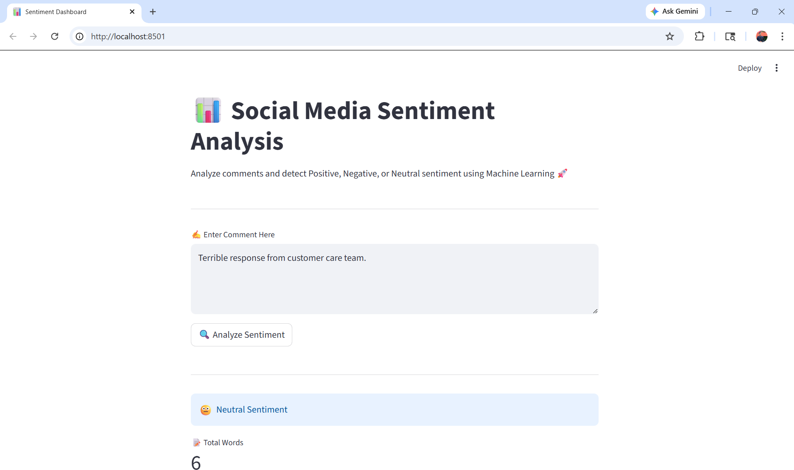
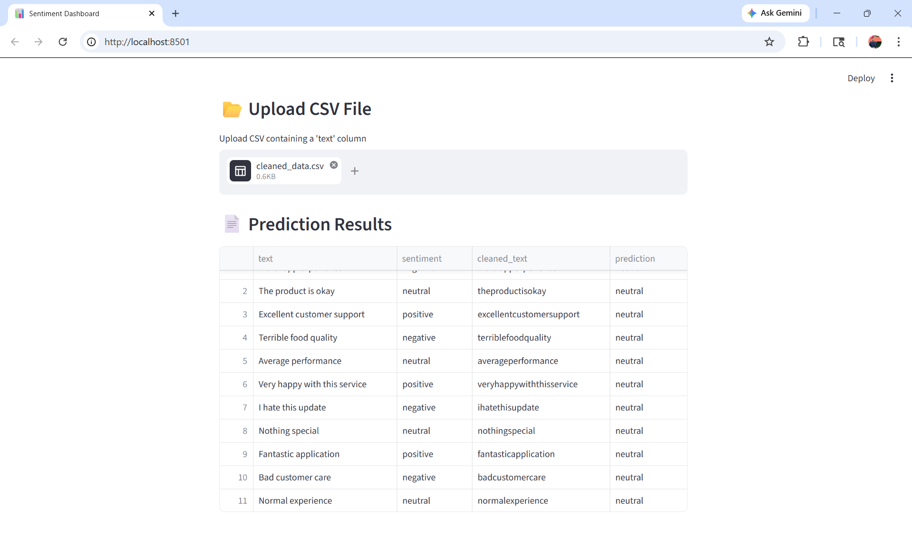
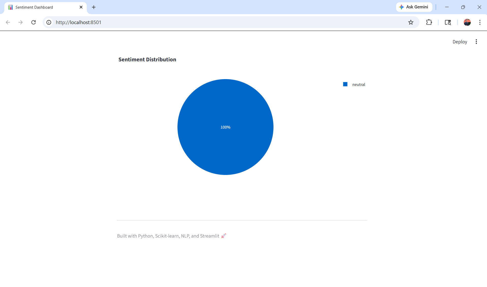

````markdown
# 📊 Social Media Sentiment Analysis Dashboard using Machine Learning & NLP


---

# 🚀 Dashboard Preview







---

## 📌 Overview

This project implements an end-to-end **Social Media Sentiment Analysis Dashboard** using Machine Learning and Natural Language Processing (NLP).

The system classifies social media comments into:

- 😀 Positive
- 😡 Negative
- 😐 Neutral

The dashboard analyzes text-based comments, predicts sentiment using ML models, and visualizes results interactively using Streamlit.

---

## 🛠 Problem Statement

Companies receive thousands of customer comments, reviews, tweets, and feedback daily.

Manual analysis becomes difficult because:

- ❌ Huge amount of text data
- ❌ Real-time monitoring is difficult
- ❌ Customer complaints may be missed
- ❌ Brand reputation changes rapidly
- ❌ Marketing campaign reactions are hard to track

---

## ✅ Solution

This project provides:

- 📊 Automated sentiment classification
- 🧠 NLP-based text analysis
- ⚡ Real-time sentiment prediction
- 📈 Sentiment distribution visualization
- 🖥 Interactive Streamlit dashboard
- 🔍 CSV upload for bulk prediction
- 📉 Business insight generation

---

## 🏭 Industry Relevance

| Industry | Application |
|----------|-------------|
| E-Commerce | Product review analysis |
| Banking | Customer feedback monitoring |
| Food Delivery | Complaint analysis |
| Entertainment | Audience reaction analysis |
| Marketing | Campaign sentiment tracking |
| Politics | Public opinion analysis |
| Startups | Brand reputation monitoring |

---

## 📊 Business Impact

- 💬 Understand customer emotions instantly
- 📉 Detect negative reviews quickly
- 📈 Improve marketing decisions
- 🔒 Monitor brand reputation
- ⚡ Reduce manual analysis effort
- 📊 Generate business insights from social media

---

## ⚙ Tech Stack

- **Language:** Python
- **Data Processing:** Pandas, NumPy
- **NLP:** NLTK
- **Machine Learning:** Scikit-learn (Logistic Regression)
- **Feature Extraction:** TF-IDF Vectorization
- **Visualization:** Plotly, Matplotlib
- **Dashboard:** Streamlit
- **Model Storage:** Joblib

---

## 📊 Dataset

### Dataset Information

- Synthetic social media comments
- Positive, Negative, and Neutral labels
- CSV-based simulation dataset

### Features

- Text Comment
- Sentiment Label

### Target

- `positive`
- `negative`
- `neutral`

---

## 🏗 System Architecture

```bash
Social Media Comments
        ↓
Text Cleaning
        ↓
NLP Preprocessing
        ↓
TF-IDF Vectorization
        ↓
Machine Learning Model
        ↓
Sentiment Prediction
        ↓
Dashboard Visualization
````

---

## 📁 Project Structure

```bash
Social-Media-Sentiment-Analysis-Dashboard/
│
├── app/
│   └── streamlit_app.py
│
├── data/
│   ├── social_media_data.csv
│   └── cleaned_data.csv
│
├── images/
│   ├── dash5.1.png
│   ├── dash5.2.png
│   └── dash5.3.png
│
├── models/
│   ├── sentiment_model.pkl
│   └── vectorizer.pkl
│
├── src/
│   ├── data_preprocessing.py
│   ├── train_model.py
│   └── predict.py
│
├── requirements.txt
├── README.md
└── main.py
```

---

## ⚙ Installation & Setup

```bash
git clone https://github.com/maheshbhakre/social-media-sentiment-analysis-dashboard.git

cd social-media-sentiment-analysis-dashboard

python -m venv venv

venv\Scripts\activate

pip install -r requirements.txt
```

---

## ▶️ Usage

### Run Data Preprocessing

```bash
python src/data_preprocessing.py
```

### Train Machine Learning Model

```bash
python src/train_model.py
```

### Run Dashboard

```bash
streamlit run app/streamlit_app.py
```

---

## 📊 Model Performance

* Logistic Regression achieved strong sentiment classification performance
* TF-IDF improved text feature extraction
* Effective for text classification tasks

### Evaluation Metrics Used

* Accuracy
* Precision
* Recall
* F1-Score
* Confusion Matrix

---

# 🧠 NLP + Machine Learning Workflow

```bash
Social Media Comments
        ↓
Text Preprocessing
        ↓
TF-IDF Feature Extraction
        ↓
Machine Learning Model
        ↓
Sentiment Prediction
        ↓
Dashboard Visualization
```

---

# 🌍 Real-World Applications

* 🛒 Product Review Analysis
* 🍔 Food Delivery Feedback Monitoring
* 🎬 Movie & Entertainment Sentiment Analysis
* 🏦 Banking Customer Feedback
* 📱 Social Media Monitoring
* 📈 Marketing Campaign Analysis
* 🗳 Political Opinion Mining

---

# 🔥 Future Improvements

* BERT-based NLP Model
* Real-Time Twitter API Integration
* Emotion Detection
* Topic Modeling
* Multilingual Sentiment Analysis
* Cloud Deployment
* Live Streaming Dashboard

---

# 👨‍💻 Author

## Mahesh Bhakre

---

# 🌐 Connect With Me

<a href="https://github.com/maheshbhakre">

</a>

<a href="https://www.linkedin.com/in/maheshbhakreds1242">

</a>

<a href="https://www.instagram.com/mahesh_bhakre__2k06">

</a>

<a href="https://saimfsd.github.io/mahesh-portfolio/">

</a>

---

# ⭐ NOTE

This project demonstrates a complete end-to-end NLP and Machine Learning pipeline for Social Media Sentiment Analysis, including:

* Text preprocessing
* NLP feature extraction
* TF-IDF vectorization
* Sentiment classification
* Model training
* Evaluation metrics
* Visualization dashboard
* Real-time prediction simulation

The project simulates how modern companies analyze customer emotions, public opinions, and brand reputation using Machine Learning and NLP.

```
```
